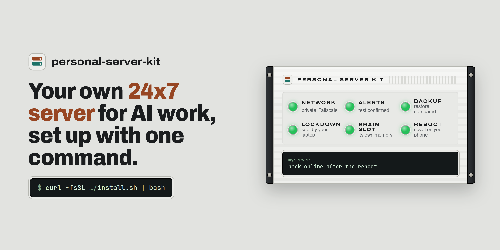
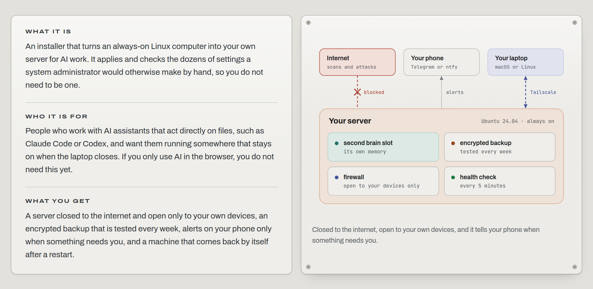
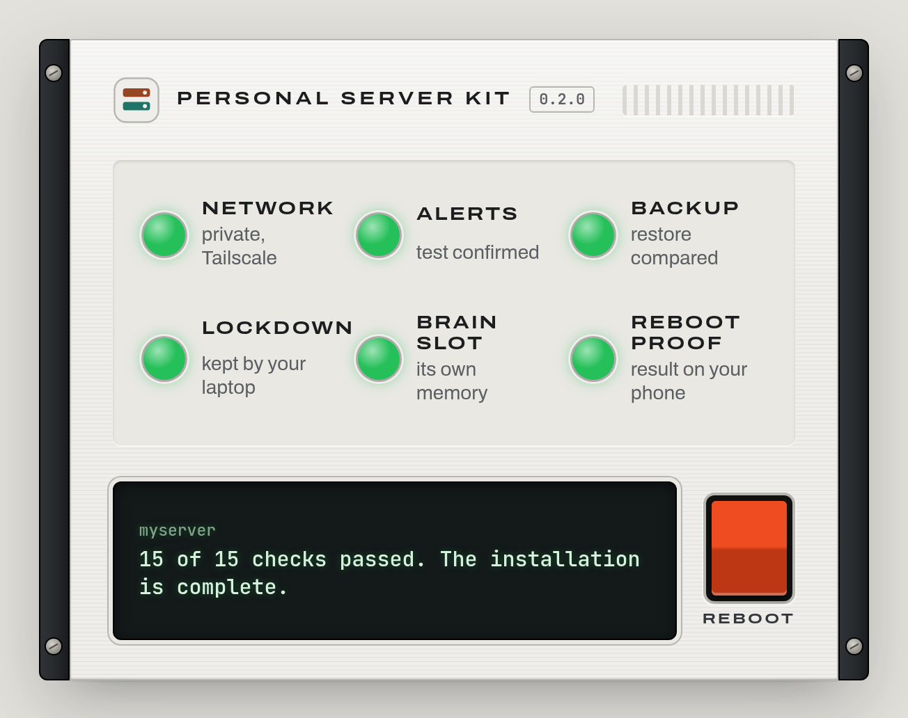
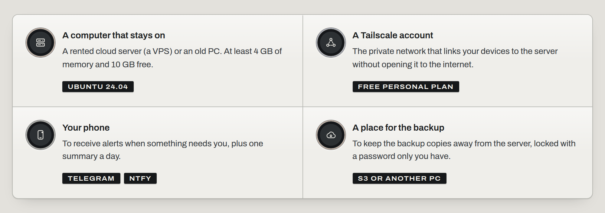
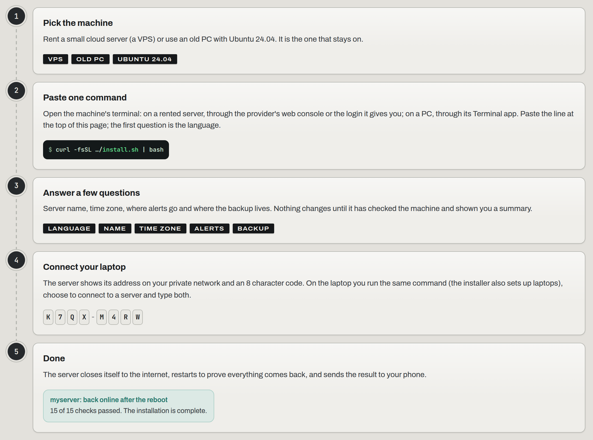
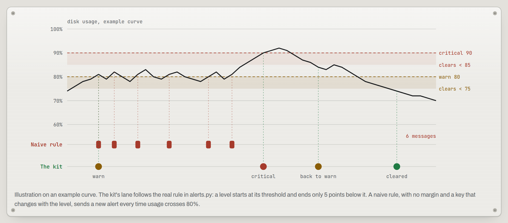
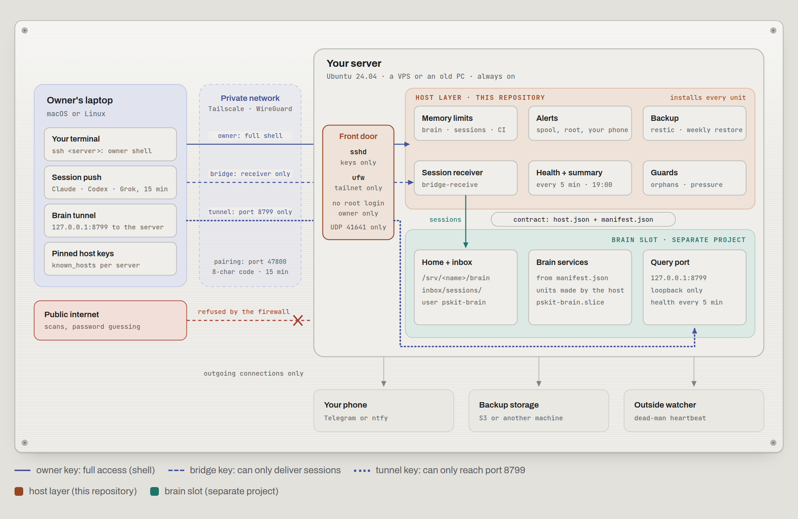
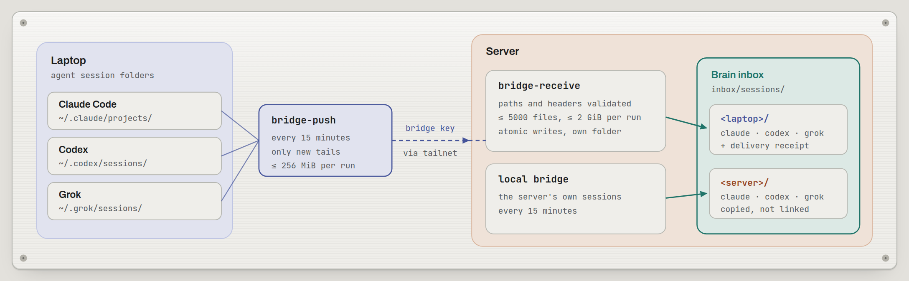
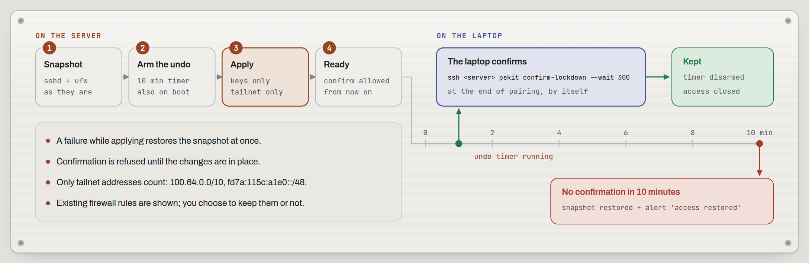

<p align="center">
  <picture>
    <source media="(prefers-color-scheme: dark)" srcset="docs/assets/banner-dark.png">
    
  </picture>
</p>

<p align="center">
  <a href="https://github.com/ogabrielalonso/personal-server-kit/actions/workflows/ci.yml"></a>
  <a href="https://github.com/ogabrielalonso/personal-server-kit/releases/latest"></a>
  
  
  <a href="LICENSE"></a>
</p>

<h1 align="center">personal-server-kit</h1>

<p align="center">
  Turn an always-on machine into a personal 24x7 server for AI work sessions,<br>
  with a reserved place for the owner's second brain. One terminal command, a few questions<br>
  in English or Portuguese, verified steps, and a reboot at the end to prove everything comes back.
</p>

<p align="center">
  <a href="https://personal-server-kit.vercel.app"><b>Project page (English and Portuguese)</b></a> ·
  <a href="#quick-start">Quick start</a> ·
  <a href="#for-engineers">For engineers</a> ·
  <a href="#documentation">Documentation</a> ·
  <a href="#license">License</a>
</p>

## In one minute

<picture>
  <source media="(prefers-color-scheme: dark)" srcset="docs/assets/readme/overview-dark.png">
  
</picture>

If something fails, you get one sentence, a next action and a diagnostic file to send.

## Every promise, proven

<p align="center"><picture>
  <source media="(prefers-color-scheme: dark)" srcset="docs/assets/readme/panel-dark.png">
  
</picture></p>

Each lamp is a promise the installer checks, and it turns green only when its proof passes:
the private network is up, you confirmed a test alert on your phone, the first backup was
restored and compared by hash, your laptop logged in before the lockdown was kept, the brain
slot is ready, and the machine came back after a reboot and told your phone. *Example server
and count; the real message reports your own number of checks.*

> **Status: 0.2.0.** The Linux server scenario (Ubuntu 24.04) is complete and
> tested end to end on a throwaway virtual machine in CI, including pairing a
> second user as "the laptop" over real SSH. It was also run by hand on real
> virtual machines: real Tailscale, Telegram alerts, an SFTP backup to another
> machine, two laptops paired, the lockdown checked from outside and a real
> reboot proof. Not yet done: a rented VPS from a provider, and a laptop
> paired from a real Mac. See [docs/TESTING.md](docs/TESTING.md).

## Why this exists

A server that runs AI sessions day and night breaks in predictable ways: an
SSH service that does not come back after a reboot, a laptop that silently
stops sending its sessions, a root disk filled by temporary files and agent
histories, backups that fail because the laptop holding them is asleep,
memory limits that add up to more than the machine has, and alerts that
repeat until nobody reads them. Each of those is a rule in this kit, applied
and verified by the installer.

## Requirements

<picture>
  <source media="(prefers-color-scheme: dark)" srcset="docs/assets/readme/needs-dark.png">
  
</picture>

| For | What you need |
|---|---|
| The server | Ubuntu 24.04 LTS (a rented VPS or an old PC) with a user that has sudo; at least about 4 GiB of RAM and 10 GiB of free disk (8 GiB and 30 GiB recommended). The server is Linux only (decision D8 in [docs/DECISIONS.md](docs/DECISIONS.md)). |
| The private network | A [Tailscale](https://tailscale.com) account. The installer shows a login link, or reads an auth key from `TS_AUTHKEY`. If your tailnet has custom access rules, the server, the laptop and an SFTP backup destination must be allowed to reach each other; the installer says so when a rule blocks them. |
| Alerts on your phone | A Telegram bot, or an [ntfy](https://ntfy.sh) topic (no account needed). |
| Backups | S3-compatible storage, or another machine you own reachable over SFTP. A local disk is allowed with a warning. |
| The laptop | macOS or Linux with Python 3.9 or newer (the macOS command line tools include it), and Tailscale signed in to the same account. On Ubuntu the installer installs Tailscale itself (and signs in with `TS_AUTHKEY` when set, handy for several laptops); on a Mac, install the app from tailscale.com/download. |

Nothing has to be installed before the installer: it uses only the Python
standard library.

## Quick start

<picture>
  <source media="(prefers-color-scheme: dark)" srcset="docs/assets/readme/journey-dark.png">
  
</picture>

On the machine that will be the server:

```bash
curl -fsSL https://raw.githubusercontent.com/ogabrielalonso/personal-server-kit/main/install.sh | bash
```

Or from a copy of this repository: `./install.sh`. The installer re-runs
itself with `sudo` when it needs root, carrying the answers given so far.

1. The first question is the language (English by default, Portuguese as an
   option); the second is what this computer is.
2. Preflight checks the machine and shows a plain summary. Nothing changes
   before you confirm.
3. Each step checks the machine, acts, and proves the result. If a step
   fails, you get one sentence, a next action and a diagnostic file; running
   the installer again resumes where it stopped.
4. Near the end the server shows an address and a pairing code. On your
   laptop, run the same command, choose "connect it to a server", and type
   them.
5. The server closes public access with a 10-minute automatic undo, keeps it
   only after your laptop logs in over the private network, then reboots and
   sends the result to your phone.

Running over SSH? Use `tmux` if you can. For unattended installs, pass an
answers file with `--answers FILE --non-interactive` (secrets come from
environment variables, never from the file); see
[docs/INSTALLER.md](docs/INSTALLER.md).

## What the owner gets

| Area | What happens | Proven by |
|---|---|---|
| Access | Private network (Tailscale); SSH with keys only, for the owner only; firewall closes everything else | the laptop logs in over the tailnet before the change is kept; otherwise it reverts by itself in 10 minutes |
| Memory | Limits per group (brain, owner sessions, CI) whose sum stays below RAM | `systemctl show` of each slice |
| Disk | `/tmp` cleaned after 10 days, conservative cache cleanup, alerts with hysteresis | health check every 5 minutes |
| Alerts | Telegram or ntfy on the phone; one message when a problem starts, changes or clears; a daily summary | a test alert the owner confirms at install |
| Outside watcher | Optional heartbeat to a dead-man service (a machine cannot report its own death) | the timer is active; the pings show on the watcher's page (the installer does not check them) |
| Backup | restic, encrypted, to cloud storage or another machine; nightly, retry in the evening, weekly restore test | first backup and a restore compared by hash at install |
| Brain slot | Service user, home, memory reservation, heavy-job lock, loopback port, session inbox, backup list, health polling | the brain's own manifest and end-to-end test |
| Sessions | Claude Code, Codex and Grok sessions from the laptop and from the server itself arrive in one inbox | delivery receipt per device; silence is reported |
| Reboot | The last step reboots and checks everything came back | a result message on the owner's phone |

<picture>
  <source media="(prefers-color-scheme: dark)" srcset="docs/assets/readme/alerts-dark.png">
  
</picture>

## Scenarios

| Scenario | Machine | Status |
|---|---|---|
| Linux server | Rented VPS or an old PC with Ubuntu 24.04 | complete, CI end-to-end |
| Local only | The laptop itself, no server | hands off to the [brain kit](https://github.com/ogabrielalonso/second-brain-kit) |
| Laptop | Connects a laptop to a server: tunnel, session delivery, pinned host keys | tested in CI on Linux; macOS parts not run on a Mac yet |

## How it works

<picture>
  <source media="(prefers-color-scheme: dark)" srcset="docs/assets/readme/architecture-dark.png">
  
</picture>

The kit is the **host layer**: access, memory, alerts, backup and the
reserved slot. The second brain is a separate project that runs inside that
slot. The two meet only through a written contract
([docs/HOST-BRAIN-CONTRACT.md](docs/HOST-BRAIN-CONTRACT.md)):

- the host writes `/etc/pskit/host.json` (no secrets) and gives the brain an
  identity, a home, a memory reservation, a heavy-job lock, a loopback port,
  a session inbox, backup of the paths it lists, alerts through
  `pskit notify`, and health polling;
- the brain declares what it needs in a JSON manifest (services, schedules,
  health URL, backup paths, peak memory, an end-to-end test) and promises to
  write only in its home, listen only on loopback, and report failures
  through `pskit notify`.

The host never reaches into the brain, and the brain never configures the
machine. [docs/STRUCTURE.md](docs/STRUCTURE.md) lists every component the kit
installs and why it exists.

Sessions from every device end up in one place: Claude Code, Codex and Grok
sessions from each laptop and from the server itself are pushed to the brain's
inbox, with a delivery receipt per device.

<picture>
  <source media="(prefers-color-scheme: dark)" srcset="docs/assets/readme/sessions-dark.png">
  
</picture>

## Security at a glance

<picture>
  <source media="(prefers-color-scheme: dark)" srcset="docs/assets/readme/lockdown-dark.png">
  
</picture>

- Nothing listens on the public internet once the install finishes: the
  firewall admits only the Tailscale interface and Tailscale's own port.
- SSH accepts keys only, for the owner only, with root login off.
- Each laptop gets three keys with forced restrictions: a shell key, a
  tunnel key that can reach only the brain port, and a delivery key that can
  only drop session files.
- Pairing needs a one-time code shown on the server's screen; host keys are
  pinned, so there is no trust-on-first-use prompt.
- Alert credentials stay in a root-only folder; everyone else, the brain
  included, alerts through a spool.
- The diagnostic file lists secret files but never their content, and
  redacts tokens, keys, passwords and public addresses.

The full threat model, including what the kit does not protect against, is
in [docs/SECURITY.md](docs/SECURITY.md).

---

## For engineers

### Commands

```text
pskit install              guided installer (also resumes after a failure)
pskit doctor [--audit]     plain-language checks; --audit works on any Ubuntu machine
pskit doctor --bundle      write the diagnostic file (no secrets)
pskit status               short summary
pskit prove [--status]     reboot proof on demand, or show the last result
pskit notify SEV TITLE     alert the owner (used by the brain; sev = critical, warn, info)
pskit brain apply FILE     install the brain's services from its manifest
pskit pair-serve           server: accept one more laptop (shows an address and a code)
pskit forget-device NAME   server: revoke a lost or replaced laptop
pskit backup run|restore-test|snapshots
pskit uninstall            undo everything from the change ledger (data kept)
```

### Uninstalling

```bash
sudo pskit uninstall                    # keeps data and the lockdown
sudo pskit uninstall --remove-lockdown  # also restores the previous firewall and SSH settings
sudo pskit uninstall --purge-data       # also deletes the workspace and the brain home
```

Every change the installer made is in a ledger, so uninstall reverses exactly
those. Packages are listed, never removed, and files you changed after the
kit wrote them are kept aside. On a laptop:
`pskit uninstall --device --server <name>`.

### Repository map

| Path | What |
|---|---|
| `install.sh` | bootstrap: finds Python, gets the code, starts the installer |
| `pskit/` | the kit, Python standard library only (3.9 or newer) |
| `pskit/linux` | server steps |
| `pskit/device` | the laptop side: pairing, tunnel, session delivery |
| `pskit/server` | pairing server and authorized keys |
| `pskit/runtime` | health, digest, heartbeat, reaper, cache, pressure guard, backup |
| `pskit/templates` | systemd units, tmpfiles, sshd and other files the kit installs |
| `pskit/locales` | English and Portuguese messages |
| `examples/` | brain manifest and answers files |
| `tests/` | unit tests; `tests/e2e/run.sh` for a throwaway VM |
| `docs/` | see below |

### Documentation

- [INSTALLER](docs/INSTALLER.md): the flow, every step, unattended installs.
- [OPERATIONS](docs/OPERATIONS.md): daily life, updates, devices, **restoring from backup**.
- [TROUBLESHOOTING](docs/TROUBLESHOOTING.md): what to do when something fails.
- [SECURITY](docs/SECURITY.md): threat model and every protection.
- [HOST-BRAIN-CONTRACT](docs/HOST-BRAIN-CONTRACT.md): the interface for the brain layer.
- [STRUCTURE](docs/STRUCTURE.md): the host layout, component by component, and why each piece exists.
- [DECISIONS](docs/DECISIONS.md): what was decided and why; what is still open.
- [TESTING](docs/TESTING.md): what is proven, where, and what is not yet.

### Development

```bash
python3 -B -m unittest discover -s tests -t .
uvx --from ruff==0.12.11 ruff check pskit tests
uvx --from mypy==1.18.2 mypy pskit
shellcheck -x install.sh tests/e2e/run.sh
```

Unit tests run anywhere without root: every step runs against a temporary
root directory. `tests/e2e/run.sh` reconfigures the whole machine and refuses
to run outside GitHub Actions. Texts use no en or em dashes; CI checks it.

### Reporting security problems

Use GitHub's private vulnerability reporting: the repository's **Security**
tab, **Report a vulnerability**. Please do not open public issues with
diagnostic files attached.

## License

[PolyForm Noncommercial 1.0.0](LICENSE). Personal and other noncommercial use
is allowed; commercial use requires written permission from the author.

Required Notice: Copyright (c) 2026 Gabriel Alonso (https://github.com/ogabrielalonso)

<p align="center">
  <br>
  Made by <b>Gabriel Alonso</b><br>
  <a href="https://github.com/ogabrielalonso">GitHub</a> · <a href="https://www.linkedin.com/in/ogabrielalonso/">LinkedIn</a> · <a href="https://personal-server-kit.vercel.app">Project page</a>
</p>
